## Backend for apartment booking service! 📚✨
***
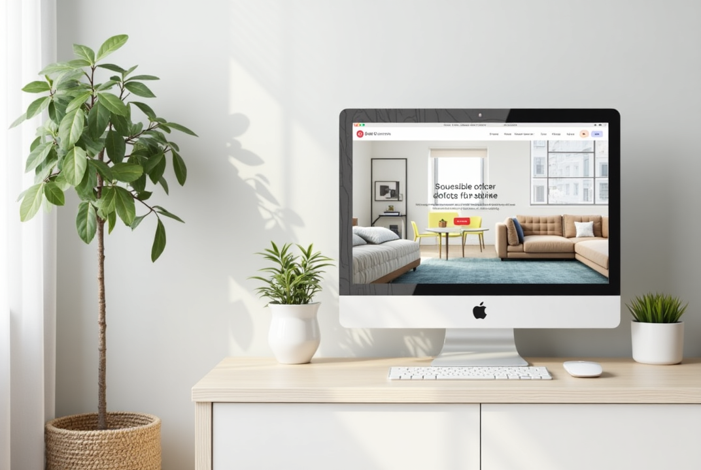

***


***

### Table of Contents
***

1. [Introduction](#introduction)
2. [Main structure](#structure)
3. [Installation](#installation)
4. [Configuration](#configuration)
5. [How to run project](#how-to-run-project)
6. [Postman Collection](#postman-collection)
7. [API Documentation](#api-documentation)

## 😊 Introduction
***
### Hi everyone!

This section is responsible for the backend functionality. It handles essential tasks like user
registration, add accommodation, address, booking functionality, payment, admins notification by telegramBot.

The system is developed with the Spring Boot framework, adhering to the MVC architectural pattern. It utilizes a PostgreSQL database for backend support and manages the schema using Liquibase. All functionalities are exposed through a RESTful API, complemented by integrated Swagger documentation for a smooth user experience.

### How it Works:

- **Register:** To get access to all the features, start by creating an account.
- **Browse accommodations and booking it:** Explore our wide selection of accommodation, booking accommodation on needs 
  date, and pay or canceled a booking.
- **Personal Account:** Your booking and payments history are stored in your personal account, making it easy to keep track.

## Structure
***
### Entities (models) in this app:

1. ⚙️ ***Tables structure:***

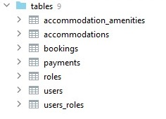

2. ⚙️ ***User:*** Stores information about the registered user, including their authentication data. Logging by email, 
   password.

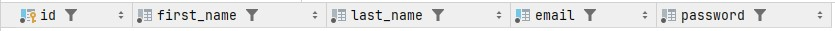
 
3. ⚙️ ***Role:*** Displays the roles assigned to users to manage their access and permissions in the system. By 
default, the USER role is assigned.

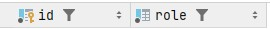

4. ⚙️ ***Accommodation:*** Represents the available accommodations.
5. ⚙️ ***Location:*** Displays the geographical location of the property (street and building number, city, country).

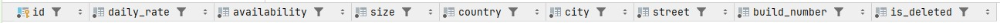

6. ⚙️ ***Amenity:*** Displays features or amenities available in the property (fireplace, pool, wi-fi).

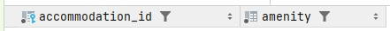

7. ⚙️ ***Booking:*** Displays the reservation made by the user for the property, the date of check-in and 
   check-out. 
   It also assigns a status, which changes upon successful booking.

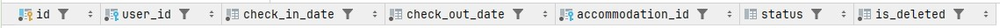

8. ⚙️ ***Payment:*** Displays the payment details for the reservation

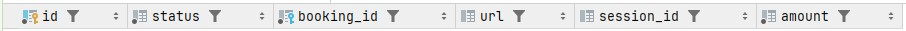

## ⚙️ Installation
***

 - Make sure you have the following installed on your machine Java Development Kit - Version 17 or higher and 
   Maven

 - To build and run this application locally, you'll need latest versions of Git, JDK installed on your computer.

 - Clone the repository:
 ``` git clone https://github.com/Stelmaschyk/apartment.git ```

## Configuration
***

#### Configure .env

* This project uses the following environment variables to configure the application. You should fill in a `.env` 
  file at the root of your project and populate it with the variables listed below.
* ***IMPORTANT*** Don't forget to rename the ```.env.sample``` file to ```.env```

```env
# PostgresSQL Database Configuration
POSTGRES_USER=username                # The PostgresSQL database username
POSTGRES_PASSWORD=password            # The PostgresSQL database password
POSTGRES_DATABASE=database            # The name of the database
POSTGRES_LOCAL_PORT=3307              # The local PostgresSQL port (for local development)
POSTGRES_DOCKER_PORT=3306             # The PostgresSQL port exposed in Docker container

# JWT Configuration
JWT_SECRET="anyStringLongerThan30characters"        # Secret key used for JWT token generation
JWT_EXPIRATION=3000000000000                        # Expiration time for JWT tokens in milliseconds

# Spring Application Configuration
SPRING_LOCAL_PORT=8081       # The local port for the Spring application
SPRING_DOCKER_PORT=8080      # The port for the Spring application in the Docker container
DEBUG_PORT=5005              # The port for debugging the application

TELEGRAM_BOT_NAME=botName    # Сome up with a name and register the Bot (Find @BotFather on Telegram)
TELEGRAM_BOT_TOKEN=token     # Add token

STRIPE_SECRET_KEY=stripeKey            # Add token
APP_URL=http://localhost:8080
```

#### Configure Database:

- Open ``` src/main/resources/application.properties ``` file and update following properties with your database
  connection details

```
spring.application.name=apartment
spring.datasource.url=jdbc:postgresql://localhost:5432/name
spring.datasource.username=${POSTGRES_DATABASE}
spring.datasource.password=${POSTGRES_PASSWORD}
spring.datasource.driver-class-name=org.postgresql.Driver
spring.jpa.database-platform=org.hibernate.dialect.PostgreSQLDialect
```

## How to run project
***

**After set up** the PostgreSQL database, build the project with command: ```mvn clean package```

1) Then, ensure that Docker has installed. If, not , you can download it here:
```https://www.docker.com/products/docker-desktop/```

2) Launch the Docker application.

3) After opening the project in your IDE, navigate to the ```Dockerfile``` and initiate the creation of images.

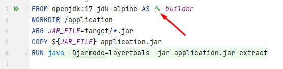

4) Next, open the ```docker-compose.yml``` file and sequentially create containers.
Start with the database container:

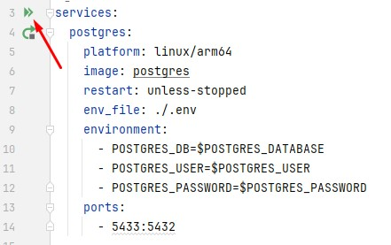

5) Once it is successfully created, proceed to create the application container.

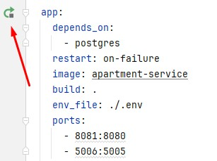

6) Finally, run the project.

7) You can test the application using Postman.

## Postman Collection
***
For your convenience in testing with Postman, below is the link to the Postman collection for this project. It 
contains a set of requests for testing.

For ease of reading, a file [apartment_postman-collection](./src/main/resources/images/apartment-postman-collection.txt) with queries has also been added

### Get Started

To get started with this collection:

1. **Import the Collection**:
   - Click the link below to import the collection into Postman:
     [Import Collection](./src/main/resources/images/appart.postman_collection_for_IMPORT.json)

2. **Environment Setup**:
   - Make sure to configure the required environments before making requests.

Once everything is set up, you can begin sending requests to the endpoints specified in this collection.


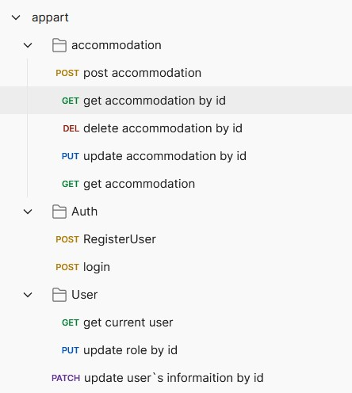
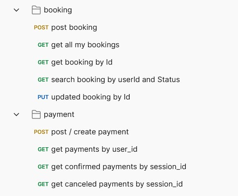


## API Documentation
***

Explore all available requests and their options using the interactive **Swagger UI** documentation.

#### How to Access Swagger UI:
1. Ensure your server is running locally at `http://localhost:8080`.
2. Open [Swagger UI](http://localhost:8080/api/swagger-ui/index.html#/).
3. Test and explore API endpoints directly in the interface.

Swagger documentation is automatically updated whenever new controllers are added or existing ones are modified.


